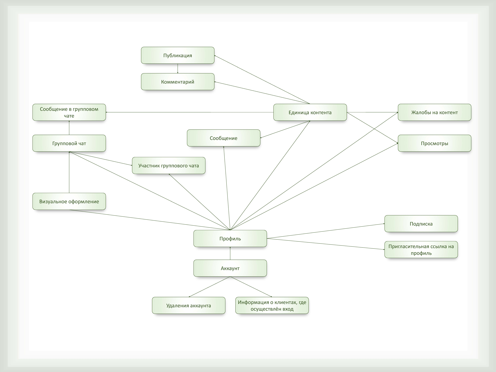

# API.Messanger
## Назначение
Проект, реализованный на .NET/C#, по созданию API, выполняющего функции мессенджера. Отличительной чертой этого проекта является поддержка мульти-профиля: на каждом номере телефона может быть до 10 публичных пространств. Они вбирают в себя возможности групп из социальной сети "ВКонтакте" и аккаунта из мессенджера "Telegram".

На данном этапе ведётся разработка базы данных.

## Предупреждение
Данный проект создаётся исключительно в учебных целях. Реализация его функционала на территории РФ нарушала бы пакет Яровой, так как данный проект не подразумевает хранение истории переписок (при условии удаления профиля или аккаунта).

## Концептуальная схема базы данных
